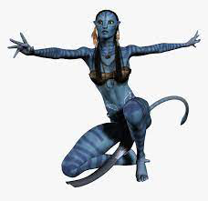

# SteganoGopher 

SteganoGopher is a steganography CLI written in pure go make for Gophers.
You can use this tool to encode/decode text messages into/from .PNG files.

## Demostration
| Original | Edited Image |
| -------- | -------------|
|| |

The second image contains a hidden message ;-)